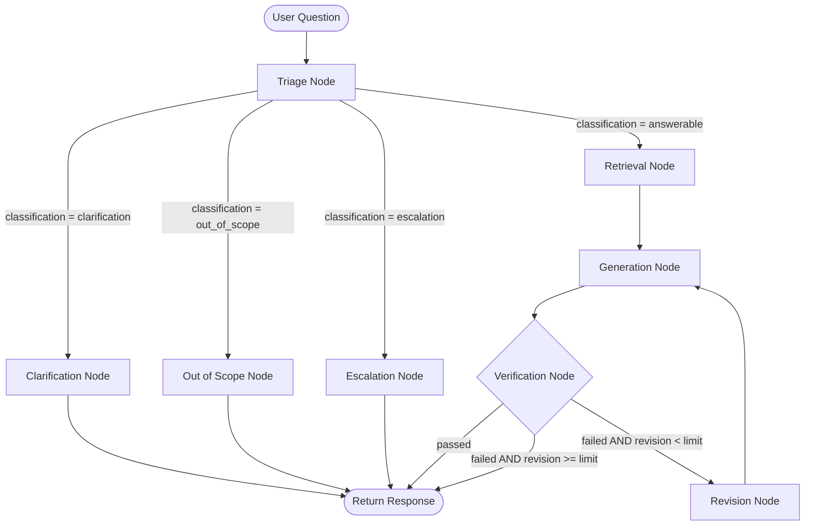

# OrbitDesk Local Support Agent

A robust, local-first RAG and LangGraph-driven customer support agent for **OrbitDesk**. The project operates fully offline using local Hugging Face embedding and generation models to triage, retrieve context, generate responses, and programmatically verify outputs before presentation.

---

## 📐 System Architecture

The workflow orchestrates state machine routing using LangGraph. Each step follows a structured path to ensure that customer requests are correctly classified and answered using verified local context:



### Flow Breakdown
1. **Triage Node**: Deterministically classifies incoming requests:
   - `answerable`: Proceed to RAG and Answer Generation.
   - `clarification`: Prompt user for further details.
   - `escalation`: Route to human agent support due to error or customer request.
   - `out_of_scope`: Respond stating the topic is outside OrbitDesk's support scope.
2. **Retrieval Node**: Gathers semantically relevant documentation chunks from the local FAISS vector store.
3. **Generation Node**: Prompts the local `Qwen` model using consolidated evidence.
4. **Verification Node**: Runs deterministic post-generation validation checks:
   - Evaluates source provenance (all cited documents must exist in retrieved list).
   - Validates grounding quality (fails if hallucinated actions like "contact IT" or "try again" are present without supporting evidence).
   - Blocks fabricated menu or button references.
   - Enforces a maximum revision retry limit.
5. **Revision Node**: Rewrites prompt instructions when verification fails, directing model recovery.

---

## 🛠️ Environment Setup & Configuration

This project is built using Python 3.10 and runs fully offline.

### 1. Installation
Clone the repository and install dependencies within a virtual environment:
```bash
# Initialize and activate the virtual environment
python -m venv venv
.\venv\Scripts\activate

# Install requirements
pip install -r requirements.txt
```

### 2. Model Downloads (Offline Caching)
Run the script to download and cache the embedding and generation models locally:
```bash
python download_models.py
```

- **Embedding Model**: `sentence-transformers/all-MiniLM-L6-v2`
- **Causal Generation Model**: `Qwen/Qwen2.5-0.5B-Instruct`

---

## 🚀 Execution & Testing

### Running the App
Execute the main application loop:
```bash
python app.py
```

### Running the Test Suite
The project includes a comprehensive suite of unit and integration tests covering RAG loader, chunker, vectorstore, retriever, triage, generation, verification, and graph flows:
```bash
# Run the complete test suite
.\venv\Scripts\python -m pytest tests -v
```

All models (embedding and causal generator) are **lazy-loaded** to ensure that test suite module parsing is instant, loading models only when semantic test cases execute.
