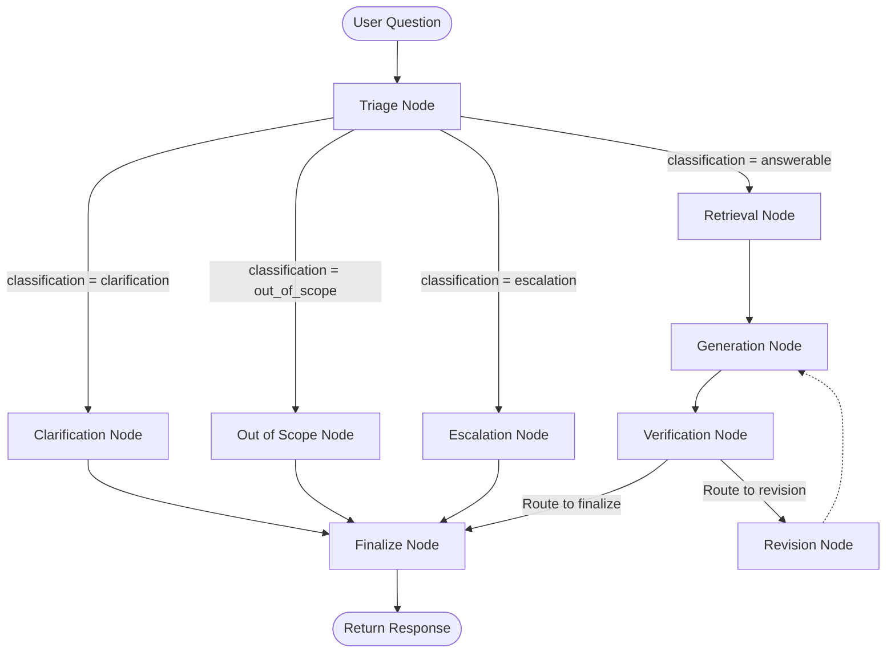

# OrbitDesk Local Support Agent

## Overview
**OrbitDesk** is a fictional local customer support and sandbox testing interface. 

The OrbitDesk Local Support Agent is an offline-first technical support assistant that processes customer support tickets and questions. Using local Retrieval-Augmented Generation (RAG), a local Hugging Face sentence embedding model, and a local causal generative LLM orchestrated via LangGraph, the agent programmatically triages queries, retrieves supporting documentation, generates candidate answers, and subjects output to multi-layered verification guardrails before presenting responses to the customer.

## Problem
In customer support platforms, automating response workflows carries the risk of generating inaccurate, hallucinated, or ungrounded recommendations (e.g., suggesting a user contact IT or retry exports when those actions are not officially documented). Standard agent structures often fail to classify vague queries correctly, leading to unnecessary data retrieval. OrbitDesk solves this by routing queries through a deterministic triage gate, grounding answer generation strictly in local evidence, and running a self-correcting generation-revision loop.

## Key Features
* **Local-First RAG**: Complete offline document retrieval using a local FAISS vector index.
* **LangGraph Node Routing**: Rigid routing based on deterministic classifications:
  * `answerable`: Routes to retrieval and generative answer pipeline.
  * `clarification`: Detects vague queries and requests detail without retrieving.
  * `out_of_scope`: Intercepts and rejects out-of-bounds questions (e.g., refund policies).
  * `escalation`: Detects consecutive failures or explicit human escalation requests.
* **Deterministic Output Verification**: 
  * Rejects ungrounded IT contact or retry/rerun troubleshooting recomendations.
  * Verifies menu, button, and settings names against raw context.
  * Invalidates citations to non-retrieved documents.
* **Self-Correction Loop**: Revises failed answers up to a maximum limit within the graph execution.
* **Verification Fallback Response**: Returns a safe, standardized message if revision fails: *"The available documentation is insufficient to determine the next step."*
* **Aesthetic Web UI**: A professional SaaS interface with source documents and live execution traces.

---

## Architecture
The agent is designed as a StateGraph state machine that routes and verifies support state transitions:



---

## Models
* **Causal Generation Model**: `Qwen/Qwen2.5-0.5B-Instruct`
  * Role: Offline language translation and answer generation based on retrieved context.
* **Embedding Model**: `sentence-transformers/all-MiniLM-L6-v2`
  * Role: Transforms raw documentation and queries into dense vector spaces.
* **Embedding Dimension**: `384`

---

## Hardware / Runtime
The application has been verified in the following local environment:
* **OS**: Windows 10
* **Python**: 3.10.0
* **CPU**: AMD64 Family 25 Model 68 Stepping 1, AuthenticAMD
* **RAM**: 15.82 GB
* **GPU**: None / CPU execution
* **Inference Device**: CPU (using `torch` CPU-only build `2.1.2+cpu` or similar)

---

## RAG Pipeline
1. **Document Loading**: Custom parser loads Markdown documents from `data/docs/`.
2. **Chunking**: Chunks text at a maximum of 500 characters with 50-character overlaps.
3. **Semantic Encoding**: Generates embeddings using `sentence-transformers/all-MiniLM-L6-v2`.
4. **Vector Storage**: Indexes embeddings in a native FAISS inner-product flat index (`IndexFlatIP`).
5. **Retrieval**: Searches the FAISS index to retrieve the top 5 most similar chunks.

---

## Agent Workflow
1. **Triage**: Deterministically evaluates the query. Routes to `clarification` (vague text), `out_of_scope` (out-of-domain terms like "subscription"), `escalation` (direct request or consecutive failures), or `answerable`.
2. **Retrieval**: Fetches relevant evidence in `SupportState`.
3. **Generation**: Invokes `Qwen2.5-0.5B-Instruct` to formulate a contextually grounded response.
4. **Verification**: Checks if the response cites valid retrieved documents, avoids forbidden IT/billing assertions, and calls only officially documented UI actions.
5. **Revision**: If verification fails and the revision limit is not reached, rewrites system prompts to instruct the generator to self-correct.
6. **Finalization**: Reviews state. If verification failed after revision, returns the fallback string: *"The available documentation is insufficient to determine the next step."*

---

## Grounding / Safety
* **Zero RAG/Generation on Categorization**: Non-answerable states immediately bypass retrieval and generation, printing static templates to prevent hallucinatory outcomes.
* **Forbidden Recommendation Blocking**: Rejects phrases warning user to `"contact IT"`, `"try again"`, `"check logs"`, or `"resubmit output"` unless these exact phrases are located in retrieved evidence.
* **Menu/Button Constraints**: Programmatically checks that UI steps reference exist in source files.

---

## Offline Usage
To run the server 100% offline, ensure the local models are downloaded and cached. Run the following commands in Windows PowerShell:

```powershell
# Set Hub Offline Flag
$env:HF_HUB_OFFLINE="1"
$env:TRANSFORMERS_OFFLINE="1"

# Start the application server
python app.py
```

Open `http://localhost:8000` in your web browser.

---

## Installation
1. Create a Python virtual environment:
   ```powershell
   python -m venv venv
   .\venv\Scripts\Activate.ps1
   ```
2. Install dependencies:
   ```powershell
   pip install -r requirements.txt
   ```
3. Prepare locally cached models (requires internet connection initially):
   ```powershell
   python download_models.py
   ```

---

## Running the Application
Ensure the virtual environment is active, then run:
```powershell
python app.py
```

---

## Testing
Verify codebase integrity by running the test suite:
```powershell
.\venv\Scripts\python -m pytest tests -v
```
**Final Verification Result**: 19 passed.

---

## Demo Scenarios
1. **Answerable**: 
   * *Query*: `"My scheduled exports stopped after I changed my workspace timezone. What should I check?"`
   * *Outcome*: Routes to `answerable`, retrieves timezone/export docs, provides grounded instructions, and lists sources.
2. **Clarification**:
   * *Query*: `"My export isn't working."`
   * *Outcome*: Routes directly to `clarification` without running RAG, requesting missing symptoms.
3. **Out of Scope**:
   * *Query*: `"Write a refund for my subscription."`
   * *Outcome*: Routes directly to `out_of_scope` indicating billing requests are out of bounds.
4. **Escalation**:
   * *Query*: `"Two consecutive runs show render_failed and all documented checks have already failed."`
   * *Outcome*: Routes directly to `escalation`, confirming human routing without asking for customer secrets.

---

### AI Coding Assistant Disclosure
AI coding assistants were used throughout this project to accelerate:
* Writing boilerplate LangGraph nodes and StateGraph routing.
* Refactoring regular expression post-processing details.
* Structuring test assertions in `tests/test_triage.py` and `tests/test_graph.py`.
* All final implementations, grounding constraints, and fallback logic were manually audited and verified by the developer.

---

* Demo video: <ADD PUBLIC VIDEO LINK>
* GitHub Repository: <ADD PUBLIC GITHUB URL>
